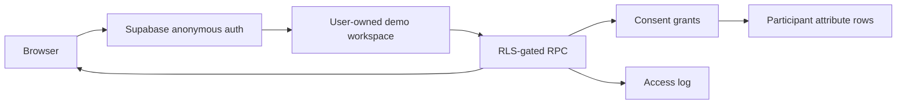

# consent-lens

> A small, opinionated exploration of the access-and-consent problem, because it seemed like the crux of a shared cross-organization talent database. I made strong choices to keep it concrete—happy to be wrong about the real constraints.

Most talent systems are black boxes about who can see a person’s data. `consent-lens` makes the permission model visible: organizations see only fields a participant granted them, participants can inspect and change those grants, and organization reads appear in the participant’s audit trail.

This is deliberately a narrow technical slice, not an ATS. It uses eight synthetic participants and three fictional organizations to make the authorization model easy to inspect.

## What to try

### Organization view

- Switch between fictional organizations and compare the same participant across tenants.
- Search for `biosecurity` as Aqueduct and then Beacon. Only Beacon can find Jon because only Beacon has access to that field.
- See ungranted fields as locked placeholders without receiving their values.
- Rename an organization inside your private demo workspace.

### Participant view

- Edit a synthetic profile and refresh the page to confirm persistence.
- Grant or revoke individual fields in the organization × field matrix.
- Return to the organization view and see the permission change immediately.
- Inspect which organizations viewed the profile and which fields they received.
- Use **Reset demo** to restore only your workspace to the original fixture.

Each browser signs in anonymously through Supabase and receives an isolated copy of the synthetic dataset. Changes persist across refreshes but do not affect other visitors.

## The core modeling decision

PostgreSQL row-level security protects rows, not individual columns. A conventional wide profile row would force field-level authorization into application filtering.

Instead, profile fields are stored as rows:

```text
participant_id   key        value                    sensitivity
maya-k           skills     Evaluations · Python     standard
maya-k           email      maya.k@example.test      sensitive
```

A consent grant identifies `(participant, organization, attribute_key)`, with `*` available as a wildcard. PostgreSQL can therefore answer “may this organization read this field?” as an RLS predicate.

This has two useful consequences:

1. **The database is the gate.** TypeScript shapes the authorized response and renders locked placeholders; it does not decide which values are returned.
2. **Search respects consent by construction.** Search runs over the RLS-filtered attribute relation, so hidden fields cannot produce matches, counts, or ranking signals.

## Architecture



There are two distinct authorization layers:

- `auth.uid()` isolates one visitor’s entire synthetic workspace from every other visitor.
- Transaction-local organization or participant context determines which attribute rows the selected demo actor may read.

The organization and participant selectors simulate roles *inside* the visitor’s private sandbox. They are useful for exploring behavior, but they are not a production identity model.

## Implementation map

- [`supabase/migrations/001_schema.sql`](supabase/migrations/001_schema.sql) — workspace-scoped relational model.
- [`supabase/migrations/002_rls_policies.sql`](supabase/migrations/002_rls_policies.sql) — workspace isolation and consent policies.
- [`supabase/migrations/003_seed_synthetic_data.sql`](supabase/migrations/003_seed_synthetic_data.sql) — resettable fixture and RPC boundary.
- [`components/OrgSearchClient.tsx`](components/OrgSearchClient.tsx) — consent-aware organization search.
- [`components/ParticipantViewClient.tsx`](components/ParticipantViewClient.tsx) — profile and grant management.
- [`components/AccessLogFeed.tsx`](components/AccessLogFeed.tsx) — organization-level audit presentation. The database records attribute reads; the UI groups them by organization.
- [`lib/policy.ts`](lib/policy.ts) and [`lib/visibleProfile.ts`](lib/visibleProfile.ts) — presentational mirrors of the policy, never the security boundary.

## Run locally

### Read-only fixture mode

```bash
npm ci
npm run dev
```

Open [http://localhost:3000](http://localhost:3000). Without Supabase environment variables, the interface remains explorable but mutations are disabled.

### Persistent Supabase mode

Prerequisites: a Supabase project and the [Supabase CLI](https://supabase.com/docs/guides/local-development/cli/getting-started).

1. Enable **Anonymous Sign-Ins** under **Authentication → Providers** in the Supabase dashboard.
2. Link and migrate the project:

   ```bash
   supabase link --project-ref YOUR_PROJECT_REF
   supabase db push
   ```

3. Create `.env.local` from the example:

   ```bash
   cp .env.example .env.local
   ```

4. Add the project URL and publishable key:

   ```env
   NEXT_PUBLIC_SUPABASE_URL=https://YOUR_PROJECT_REF.supabase.co
   NEXT_PUBLIC_SUPABASE_ANON_KEY=sb_publishable_...
   ```

5. Restart `npm run dev`.

The project URL and publishable key are intended for browser use. The service-role/secret key is not: it bypasses RLS and must never appear in the frontend or repository.

Supabase stores the anonymous session in browser storage. Clearing site data, using private browsing, or switching browsers/devices creates a new identity and therefore a fresh workspace.

## Verification

```bash
npm run lint
npm run build
```

[`supabase/tests/access_boundary.sql`](supabase/tests/access_boundary.sql) contains a focused database assertion: Aqueduct cannot read a field granted only to Beacon, while Beacon still cannot read Jon’s ungranted sensitive fields.

For a manual end-to-end check:

1. Revoke a field in the participant view.
2. Open that organization’s view and verify the field is locked.
3. Search for the revoked value and verify it produces no match.
4. Return to the participant view and inspect the grouped audit entry.

## Security notes and limits

- RLS is enabled on every demo table.
- RPCs verify workspace ownership with `auth.uid()` before accepting a simulated actor.
- Organization reads are logged per attribute; the participant UI coalesces them into one row per organization.
- Revocation affects the next database read. It cannot recall data already delivered, copied, cached, or screenshotted.
- Anonymous workspaces are intentionally disposable. There is no account recovery or cross-device continuity.
- External search indexes, exports, privileged administration, retention policy, and abuse controls would require separate security decisions.
- All people, organizations, contact details, notes, and events are synthetic.

The short threat analysis is in [`docs/threat-model-lite.md`](docs/threat-model-lite.md), with implementation detail in [`docs/rls-notes.md`](docs/rls-notes.md).

## Deliberate restraint

There is no AI-generated profile summary. In a system whose purpose is legible, consented access to sensitive records, an opaque generative interpretation would work against the thesis. Record-backed determinism is the more responsible default here.

## Not built

- Real organization membership or participant-to-account identity mapping
- Invitations, account recovery, SSO, or cross-device persistence
- ATS imports, deduplication, matching, exports, or pagination
- Notifications, audit retention controls, or abuse monitoring
- Real or scraped participant data

Those are meaningful systems, not decorative checklist items. They should follow evidence about the real operating constraints rather than be guessed into this demo.
